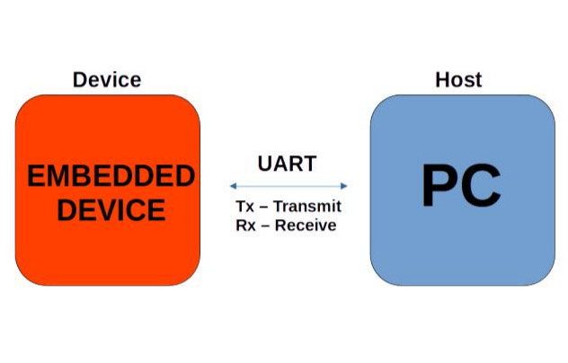

# PC Host and Embedded Device Uart Comm
This repository is dedicated to experiment with **UART (Universal Asynchronous Receiver-Transmitter)** comunication betweem **PC (Host)** and **embedded devices**
using a **serial port interface** across various software platform. Different software frameworks and libraries might be involve. Trial and error is part of the process, as this project serves as research and learning environment for understanding reliable UART-based communication.

## Objectives

- Understand UART Communication
- Experiment with data trasnmission and reception over serial port.
- Interface various microcontrollers with a PC or laptop via USB-to-Serial adapters.
- Build and test custom protocols on top of UART.
- Use different software framework to handle UART on both the embedded and host side.

