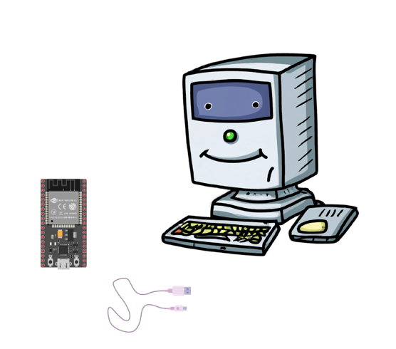

# PC Host (pyserial & pyqt) and ESP32 (esp-idf) Uart Comm 
- The PC Host runs on GUI built with PyQT5 and uses the "pyserial" library to establish
  manage UART Communication.
- The application provides a user-friendly interface to send commands, display responses, and monitor
  data from the ESP32.
- The physical connection typically uses a USB-to-UART bridge (CP2102), which converts the USB signals
  from the PC into UART signals readable by the ESP32.

© 2025 Written by Shakir Salam

