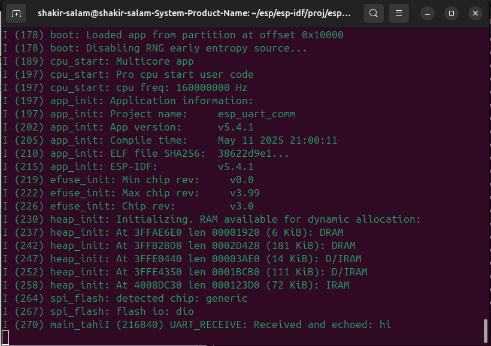

# Device Controller
## Linux Environment
### 1. Install Prequisites

 ```bash
sudo apt update
sudo apt install -y git wget flex bison gperf python3 python3-pip python3-setuptools cmake ninja-build ccache libffi-dev libssl-dev dfu-util libusb-1.0-0
```

### 2. Get ESP-IDF
```bash
mkdir -p ~/esp
cd ~/esp
git clone --recursive https://github.com/espressif/esp-idf.git
cd esp-idf
```

### 3. Run Installation Script
```bash
./install.sh
```

### 4. Set up Environemnt Variables
```bash
./export.sh
echo ". $HOME/esp/esp-idf/export.sh" >> ~/.bashrc
```

### 5. Verify Installation
```bash
cd ~/esp
cp -r $IDF_PATH/examples/get-started/hello_world .
cd hello_world
idf.py set-target esp32
idf.py build
```

### 6. Flash the code to ESP32
```bash
idf.py -p /dev/ttyUSB0 flash monitor
```

### Create a new directory for esp32 uart comm
```bash
cd ~/esp_uart_comm
cp -r $IDF_PATH../main.
cd main
idf.py set-target esp32
idf.py build flash monitor
```


visit espressif official documentation for more info
https://docs.espressif.com/projects/esp-idf/en/stable/esp32/get-started/index.html

© 2025 Written by Shakir Salam
