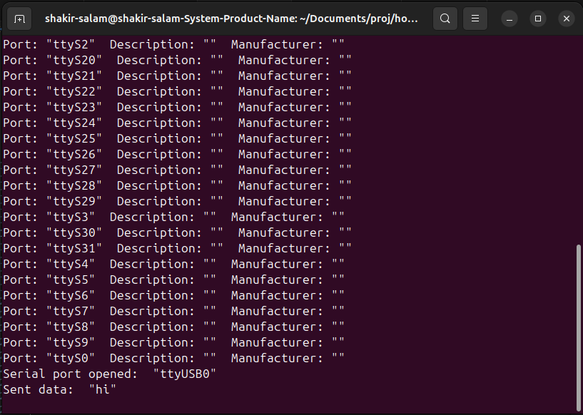

# Host Controller
## Linux Environment
### 1. Install required package using apt

Qt Libraries
 ```bash
sudo apt update
sudo apt install qt5-qmake qtbase5-dev
```

Make Tool
```bash
sudo apt update
sudo apt install make
```

### 2. Create Qt Project
```bash
mkdir host_uart_comm
cd host_uart_comm
touch main.cpp
touch host_uart_comm.pro
```

### 3. Create main.cpp
- Snippet of main code
```bash
#include <QApplication>
#include <QLabel>

int main (int argc, char *argv[])
{
    QApplication application(argc, argv);
    QWidget wd;
    qt_window(wd);
    wd.show();
    return application.exec();
}
```

### 4. Create host_uart_comm.pro
```bash
TEMPLATE = app
TARGET = host_uart_comm
QT += widgets serialport
SOURCES += main.cpp 
```

### 5. Run qmake to generate Makefile
```bash
qmake host_uart_comm.pro
```

### 6. Build Application
```bash
make
```

### 7. Run Application
```bash
./host_uart_comm
```

### 7. UI Interface
- The ui interface should displayed as shown below:



© 2025 Written by Shakir Salam
