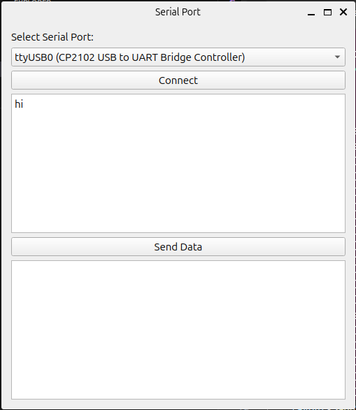

# Host Controller
## Linux Environment
### 1. Install required package using apt

Qt Libraries
 ```bash
sudo apt update
sudo apt install qt5-qmake qtbase5-dev
```

Make Tool
```bash
sudo apt update
sudo apt install make
```

### 2. Create Qt Project
```bash
mkdir QtApp
cd QtApp
touch main.cpp
touch MyQtApp.pro
```

### 3. Create main.cpp
```bash
#include <QApplication>
#include <QLabel>

int main (int argc, char *argv[])
{
 QApplication app(argc, argv);
 QLabel label("Hello, Qt!");
 label.show();
 return app.exec();
}
```

### 4. Create MyQtApp.pro
```bash
QT += core gui
greaterThan(QT_MAJOR_VERSION, 4): QT += widgets
TARGET = MyQtApp
TEMPLATE = app
SOURCES += main.cpp
```

### 5. Run qmake to generate Makefile
```bash
qmake MyQtApp.pro
```

### 6. Build Application
```bash
make
```

### 7. Run Application
```bash
./MyQtApp
```

### 7. UI Interface
- The ui interface should displayed as shown below:


© 2025 Written by Shakir Salam
